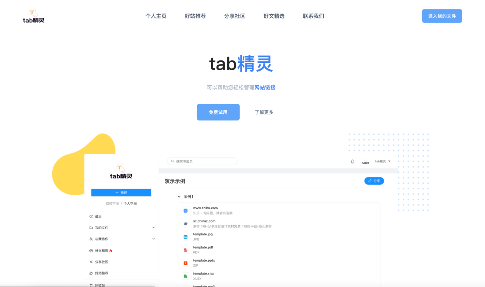
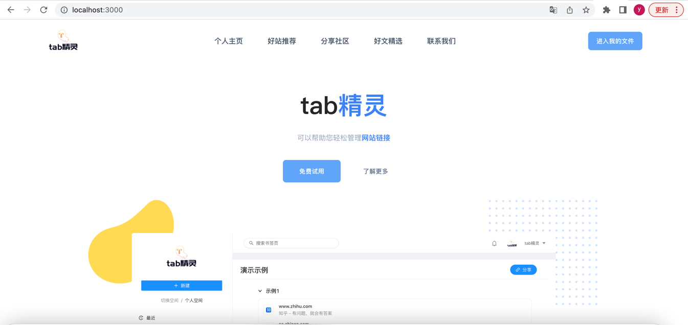

## 1. 项目介绍
tabelf 是一款基于 go-zero + ent + react + antd 的前后端分离的一个在线书签管理系统。



## 2. 在线体验
线上环境: [https://www.tabelf.com](https://www.tabelf.com)

## 3. 特性
- 前后端分离
- 遵循 RESTful API 设计规范
- 基于 go-zero 框架开发，集成中间件方便
- JWT 鉴权认证
- 基于 ent 框架进行数据库操作，操作简单方便
- 微信公众号验证码登录
- 支持多文件类型管理，支持url、文本文件、mp3、mp4等资源的管理
- 支持好站推荐、分享社区、好文精选等功能
- 支持好友分享功能共同协作

## 4. 准备工作

###4.1 环境要求

    最好是mac/linux系统，如果是 windows 系统需要安装 make 命令 或者手动 copy 命令进行执行

  go 1.18

  mysql 5.8

  node v18.4.0

  yarn 1.22.19

###4.2 backend 后端部署
```
以下所以操作都需要，命令行要进入到项目的 backend 目录下
```
```
1. 首先初始化一个数据库，例如 binghuang, 然后修改后端数据库配置文件config.yml

db: &db
  enable: true
  url: 用户名:密码@(127.0.0.1:3306)/数据库名?charset=utf8mb4&parseTime=true&loc=Local&interpolateParams=true # 数据库配置
  driver: mysql
  max_open_conns: 200
  max_idle_conns: 50   
```
    2. 安装 go.mod 依赖

       go mod tidy
```
3. 通过 ent 提供的命令初始化数据库表结构

   如果是 mac 系统生成表结构, 直接执行命令:

   make migrate

   如果window 系统也安装了 make 命令也可以执行以上指令，否则执行命令:
 
   go run cmd/main.go migrate
```
```
4. 重新生成 ent 数据模型
   mac 环境, 直接执行命令:
   
   make migrations

   windows 环境:
   
   go install entgo.io/ent/cmd/ent@v0.10.0
   ent generate --feature sql/upsert --target gen/entschema ./spec/schema
```
```
5. 邮箱配置, 配置文件config.yml, 发送邮件需要（不配置不影响启动，功能受影响）

email: &email
  username: xxxx@foxmail.com # qq 邮箱
  password: xxxx             # 授权码
  addr: smtp.qq.com
```
```
6. 微信公众号配置，登录需要（不配置不影响启动，功能受影响）

wechat: &wechat
  appid: xxxxxxxx                             # 微信 appid
  appsecret: xxxxxxxxxxxxxxxxxxxxxxxx         # 微信 appsecret
  qr_expired: 300                             # 5分钟过期 = 5 * 60
  
如果配置了，记得配置自己的微信公众号授权配置，配置微信公众号的回调地址。
```

```
7. 图片服务器配置，图片展示需要（不配置不影响启动，功能受影响）

cos: &cos
  secret_id: xxxxxxxxx                        # 腾讯cos id
  secret_key: xxxxxxxxx                       # 腾讯cos key
```
```
8. 服务启动
   命令行进入到 cmd 文件 xxx/tabelf/backend/cmd，执行命令:
   
   go run main.go start_http --env default
```
后端启动成功:


###4.3 frontend 前端部署
```
以下所以操作都需要，命令行要进入到项目的 frontend 目录下
```
```
1. 安装依赖

   yarn install
```
```    
2. 启动前端服务

  yarn start
```
```    
3. 访问

  localhost:3000
```
正常访问表示启动成功



##5. 联系方式
### QQ号 1437173153

### QQ交流群


##6. 捐赠
如果你觉得这个项目对你有帮助，你可以请作者喝饮料


##7. 技术服务
如果有什么技术问题或者定制化需求可以与我联系，QQ号 1437173153
，不免费。
